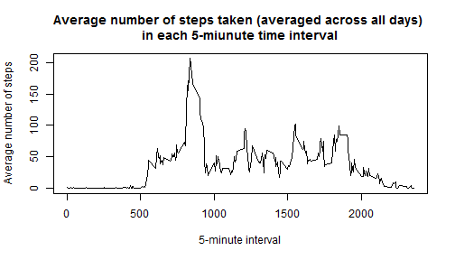
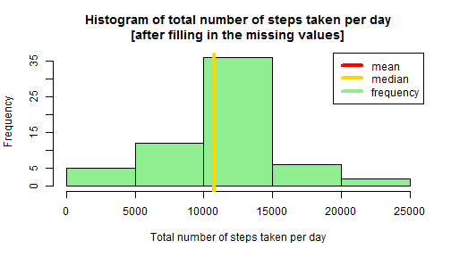

REPRODUCIBLE RESEARCH - Assignment 1
===================================== 
 
#### 1. Downloading data

```r
url <- "http://d396qusza40orc.cloudfront.net/repdata%2Fdata%2Factivity.zip"
download.file(url, destfile = "data.zip")

dane <- unzip("data.zip", files = NULL, list = FALSE, overwrite = TRUE, junkpaths = FALSE, exdir = ".", unzip = "internal", setTimes = FALSE)
```
  
  
#### 2. Reading the data into a data frame with some neccesary transformations

```r
names <- as.matrix( read.table(dane, sep = ",", skip = 0, nrows = 1) )
set <- read.table( dane, sep = ",", skip = 1, col.names = names, colClasses = c("numeric", "character", "numeric") )
set$date <- as.Date(set$date)
rm(names); rm(url); rm(dane)
```
 
 
#### 3. The mean total number of steps taken per day       

```r
total <- aggregate(set$steps, by=list(set$date), FUN=sum)
names(total) <- c("date", "steps_sum")
hist(
    total$steps_sum
    ,main = "Histogram of total number of steps taken per day"
    ,xlab = "Total number of steps taken per day"
    ,col = "lightgreen"
  )
avg <- mean(total$steps, na.rm = TRUE)
med <- median(total$steps, na.rm = TRUE)
abline(v = avg, col = "red", lwd = 4)
abline(v = med, col = "gold", lwd = 4)

legend(
    "topright"
    ,lty=1
    ,lwd = 4
    ,col = c("red", "gold", "lightgreen")
    ,legend = c("mean", "median", "frequency")
  )
```

 
 
Basic statistics of total number of steps taken each day:  
  
- mean = **1.0766189 &times; 10<sup>4</sup>**  
- median = **1.0765 &times; 10<sup>4</sup>**  
 
 
#### 4. The average daily activity pattern

```r
means <- aggregate(set$steps, by=list(set$interval), FUN=mean, na.rm = TRUE)
with(
    data = means
    ,plot(
        Group.1, x
        ,type = "l"
        ,main = "Average number of steps taken (averaged across all days) \nin each 5-miunute time interval"
        ,xlab = "5-minute interval"
        ,ylab = "Average number of steps"
        )
    )
```

 

```r
max <- means[means$x == max(means$x),1]
```
 
On average across all the days in the dataset the maximum number of steps contains the **835'th** interval.  
  
#### 5. Imputing missing values

The presence of missing days may introduce bias into some calculations or summaries of the data. 


```r
nna <- nrow(set[is.na(set$date)==TRUE | is.na(set$steps)==TRUE | is.na(set$interval)==TRUE,])
```

In analized data frame we have **2304** rows with missing values. 
To deal with the above problem it was decided to **fill in all of the missing values with the average number of steps taken in particular interval.** After filling in all of the missing values we obtain new data set 'set_new'. 


```r
vals_to_fill <- aggregate(set$steps, by=list(set$interval), FUN=mean, na.rm = TRUE)
set_merged <- merge(set, vals_to_fill, by.x = "interval", by.y = "Group.1")

set_merged = within(set_merged, {
    steps_filled = ifelse(is.na(steps) == FALSE, steps, x)
 })

set_new <- set_merged[,c(1,3,5)]
```
Now, with all of the missing values filled in, we can make a histogram of the total number of steps taken each day and compare it with the histogram made on data containing NA's.


```r
total <- aggregate(set_new$steps, by=list(set_new$date), FUN=sum)
names(total) <- c("date", "steps_sum")
hist(
    total$steps_sum
    ,main = "Histogram of total number of steps taken per day\n[after filling in the missing values]"
    ,xlab = "Total number of steps taken per day"
    ,col = "lightgreen"
  )
avg <- mean(total$steps, na.rm = TRUE)
med <- median(total$steps, na.rm = TRUE)
abline(v = avg, col = "red", lwd = 4)
abline(v = med, col = "gold", lwd = 4)

legend(
    "topright"
    ,lty=1
    ,lwd = 4
    ,col = c("red", "gold", "lightgreen")
    ,legend = c("mean", "median", "frequency")
  )
```

 
  
Basic statistics of total number of steps taken each day:  
  
- mean = **1.0766189 &times; 10<sup>4</sup>**  
- median = **1.0766189 &times; 10<sup>4</sup>**  

Mean and median do not differ from the estimates calculated on data containing missing values. **The impact of imputing missing data on the estimates of the total daily number of steps is in the kurtosis of the distribution: more observation are centered around the mean.**

#### 5. Differences in activity patterns between weekdays and weekends


```r
set_new = within(set_new, {if_weekend = ifelse(weekdays(date, TRUE) == "So" | weekdays(date) == "N", "weekend", "weekday")})
set_new$if_weekend = as.factor(set_new$if_weekend)

means <- aggregate(set_new$steps, by=list(set_new$interval, set_new$if_weekend), FUN=mean, na.rm = TRUE)
names(means) <- c("interval", "day_of_the_week", "average_steps")

library(lattice)
xyplot(average_steps ~ interval | day_of_the_week, data = means, type = "l", layout = c(1, 2))
```

 
